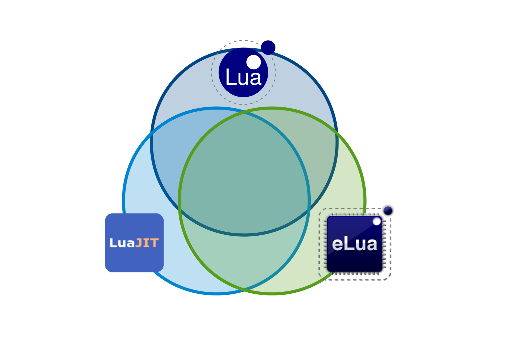
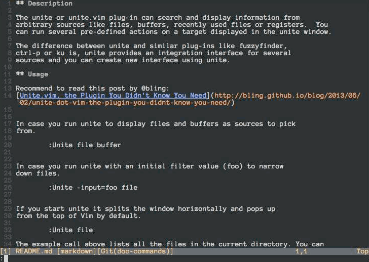
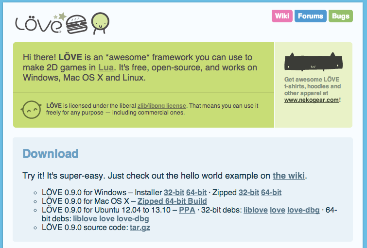
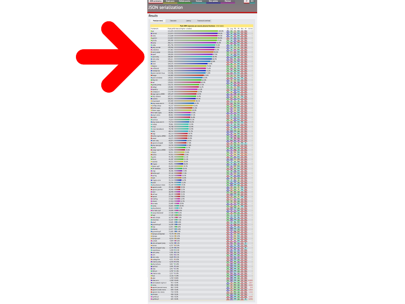

# A taste of Lua

#### Enrique García Cota
#### @otikik / http://kiki.to

#### [APIStrat](http://apistrategyconference.com/), 2014-09

---


---
# 3 main parts:

## Intro
## Feel
## Applications

---

# Part 1: Intro

---
= data-transition='fade'


---
= data-transition='fade'


---


---


## Roberto Ierusalimschy
> Lua is portable, powerful, embeddable & fast.

---

## Embeddable

---

## General purpose language

<center>~ vs ~</center>

## Embedable language

---


---


---


---


---


---

## Portable

---

## Portable

### &rArr; C99

---

## Small

---

## Small

```bash
git clone https://github.com/LuaDist/lua.git
cloc lua/src
```

### &rArr; ~ 15k (C99)

---

## Small

```bash
git clone https://github.com/LuaDist/lua.git
cloc lua/src
```

### &rArr; ~ 200KB compiled

---

## Implementations

---

## Lua (5.1, 5.2, 5.3)
## LuaJIT
## eLua
## ...

---
= data-transition='fade'



---
= data-transition='fade'


---

# Part 2: Feel

---

## Learn Lua in 15 minutes

http://tylerneylon.com/a/learn-lua/

---

```lua
local name   = 'Peter'
local age    = 35
local genter = "male"

print(name .. " is a " .. age .. ' years old ' .. gender)
```

```bash
local multilineString = [[
  Lorem ipsum
  dolor sit amet
]]
```

```lua
-- a single-line Lua comment
--[[
  a multi-line comment in Lua
]]
```

---

### Functions

```lua
-- Function declaration
local function sum(a,b)
  return a + b
end

print(sum(3,2)) -- 5
```

---

### Functions

```lua
-- Almost the same as before
local sum = function(a,b)
  return a + b
end

print(sum(3,2)) -- 5
```

---
### Conditionals

```lua
local function isEven(n)
  if n % 2 == 0 then
    return true
  end
  return false
end

print(isEven(5)) -- false
```
---
### Conditionals

```lua
local function isEven(n)
  return n % 2 == 0
end

print(isEven(5)) -- false
```
---
### Arrays & Numeric Loop

```lua
local a = {'a', 'b', 'c', 'd'}
print(a[1]) -- a

local length = #a

for i = 1, length do
  print(a[i])
end
```

---
### While loop

```lua
local a = {'a', 'b', 'c', 'd'}
print(a[1]) -- a

local length = #a

local i = 1
while i < length do
  print(a[i])
  i = i + 1
end
```

---

### Repeat until loop

```lua
local a = {'a', 'b', 'c', 'd'}
print(a[1]) -- a

local length = #a

local i = 1
repeat
  print(a[i])
  i = i + 1
until i > length
```

---

### Hashes / Objects

```lua
local person = {name = 'peter', age = 21}

print(person['name']) -- peter
print(person.name) -- also peter

for key,value in pairs(person) do
  print(key .. ' => ' .. value)
end
--[[
  name => peter
  age => 21
]]
```

---

### Hash, Array == Table

```lua
local a      = {'a', 'b', 'c', 'd'}
local person = {name = 'peter', age = 21}

print(a[1])
print(person['name'])

print(type(a)) -- table
print(type(person)) -- table
```

---

## Reuse

---

## Lua tables:

* Arrays
* Hashes
* Structs
* Objects
* References
* Environments

---

## Lua functions:

* Values
* Blocks
* Scopes
* Iterators
* Generators

---

### Types (~7)

```bash
string, number, table, boolean, function, thread, nil
```

### Libraries (~7)

```lua
string, math, table, os, io, coroutine, debug
```

### Built-in functions (~30)

```lua
assert          load          pcall       setmetatable
collectgarbage  loadfile      print       tonumber
dofile          loadstring    rawequal    tostring
error           module        rawget      type
rawset          xpcall        getfenv     next
unpack          getmetatable  require     select
ipairs          pairs         setfenv
```

---


## Libraries
### luarocks.org
### rocks.moonscript.org
### ~700 rocks

---

## Lua feels like
### A faster, smaller, better javascript

```javascript

// Very little of this stuff:
[9,10,1,2].sort()
> [1,10,2,9]

```

---

# Part 3: Applications

---


---

> Key-value data store

---

```ruby
require "redis"
redis = Redis.new('localhost', 6379)

redis.set("name", "peter")
name = redis.get("name") # "peter"

redis.set("age", "25")
new_age = redis.incr("age") # 26
```
---

> Concurrent, but single threaded

---


---


---

```ruby

counter = redis.get('counter')


redis.incr('counter') if counter.is_number?

```

---
```ruby

counter = redis.get('counter')

########## Multithreading  ##########

redis.incr('counter') if counter.is_number?

```


---

```ruby

lua_code =
%{
  local counter = redis.call("GET", KEYS[1])
  if type(tonumber(counter)) == "number" then
    return redis.call("INCR", KEYS[1])
  end
}

redis.eval(lua_code, ["counter"])

```

---


---

```bash
brew install vim --with-lua
```

-or-

```bash
brew install macvim --with-lua
```

---


---



---
```bash
                    Startup     Speed

      Vim script    0           1.498s
      Python        0.0166s     0.027s (2000%)
      Lua(jit)      0.0002s     0.001s (1152000%)
```
---


---
= data-text='centered'

## Corona SDK


---
= data-text='centered'

coronalabs.com/i-want-to-build/games/


---


---
= data-text='centered'

coronalabs.com/i-want-to-build/business-apps/


---
= data-text='centered'

### www.love2d.org




---


---


---


---


---
= data-text='centered'

### www.techempower.com/benchmarks


---
= data-text='centered'

### www.techempower.com/benchmarks




---

nginx.conf:

``` conf
http {
  server {
    location /hello {
      content_by_lua_file 'hello.lua'
    }
  }
}
```

hello.lua:

``` lua
local name = ngx.var.arg_name or "Anonymous"
ngx.say("Hello, ", name, "!")
```

Example:

```bash
$ curl http://localhost/hello?name=peter
# Hello, peter!
```

---


---


---


---


---


---
```lua
return function(req, next_middleware)
  req.headers['Authorization'] = 'My Secret'

  return next_middleware()
end
```
---

```lua
return function(req, next_middleware)

  local res  = next_middleware()
  res.body   = 'Hodor'

  return res
end
```

---


---

# Conclusion

---


---


---


---

# Questions?
#### Enrique García Cota
#### @otikik / http://kiki.to

---
= data-text='centered'


# Thank you! <span class="applause">&#9734;</span>


